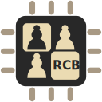

# reed-chessboard

A simple controller and UCI compatible driver to create Reed switch-based chessboards using an RP2040.

# Table of Contents
- [Table of Contents](#table-of-contents)
- [Description](#description)
- [Installation](#installation)
- [Usage](#usage)
- [License](#license)
- [Can I contribute?](#can-i-contribute)

# Description
[Back to top](#table-of-contents)

This was created mainly as a subproject of BEAUB, a robot playing OTB chess. I figured people might want to create reed switch-based chessboards themselves, since they're cheap and not too difficult, which is why this repo exists!

You can think of the project as two parts:
- The controller code, meant to run on the RP2040 micro-controller.
- A driver, making it able to act similarily to a [DGT chessboard](https://digitalgametechnology.com/).

# Installation
[Back to top](#table-of-contents)

## Compiling
**You can skip this step by downloading the [realease package]()**

To compile from source, you'll need CMake as well as Cargo. 
Then, follow those commands:

- `git clone https://github.com/AloisRautureau/reed-chessboard-controller.git`
- `cd reed-chessboard-controller`
- `cmake -S controller -B build`
- `cmake --build build`
- `cargo build --release`

You'll then find the controller binary in `build/controller/` and the driver binary in `build/release/`.

## Flashing the controller code
You'll first need to flash the controller code (`reed_chessboard_controller.uf2`) onto your RP2040-base micro-controller. How this is done may vary for each specific controller, so you'll need to refer to its documentation here.

The pinout is as follows:
- Outputing pins are GPIO0 to GPIO7
- Reading pins are GPIO8 to GPIO15
- The move validation button should be linked to GPIO 16

The outputing and reading pins should be connected to columns/ranks 1/A to 8/H.

(I'll try to add a clear schematic for this, I swear)

# Usage
[Back to top](#table-of-contents)

(This is a mock, but should look something like this)
- Connect the controller via USB
- Run the driver software
- Play, and the moves you make should appear in the terminal! Cool stuff right there

# License
[Back to top](#table-of-contents)

The project is licensed under the MIT License. Do what you want with it, basically. Be cool if you credit the author if you use it tho!

# Can I contribute?
[Back to top](#table-of-contents)

Sure... *I guess?*

The project is most likely in a finished state as of the time this repo went public, and isn't particularily scalable.

Contributions are obviously welcome when it comes to bug fixes, QOL, etc, but there won't be any real fixed way of contributing. Just contact me via email, Telegram or anything and we'll figure something out!
